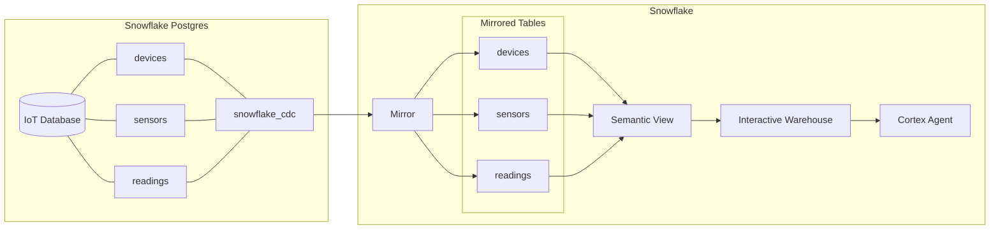

# Interactive Modern End-to-End Demo

This folder contains an end-to-end demo that walks through creating an IoT data pipeline from Postgres to Snowflake, then building analytics and an AI agent on top of the mirrored data. The scripts are meant to be run interactively in order, switching between Postgres and Snowflake at the indicated points.

## Prerequisites

This sample assumes you already have a Snowflake Postgres database correctly set up. If you need to create one, follow the [Getting Started with Snowflake Postgres](https://www.snowflake.com/en/developers/guides/getting-started-with-snowflake-postgres/) guide.

## Architecture

## Files

- **`01-postgres.sql`** -- Run on a Snowflake Postgres instance. Creates the IoT schema (`devices`, `sensors`, `readings`), inserts sample data, and enables the `snowflake_cdc` extension for mirroring.

- **`02-snowflake.sql`** -- Run on Snowflake. Sets up mirroring from the Postgres instance, creates a semantic view over the mirrored tables, provisions an interactive warehouse with cache warming, and queries the semantic view.

- **`03-postgres.sql`** -- Run on Postgres. Inserts additional readings and creates new devices to demonstrate live data replication through the mirror.

- **`04-snowflake.sql`** -- Run on Snowflake. Queries the semantic view to verify the new data has been replicated, then creates a Cortex Agent that can answer natural-language questions about the IoT data.

- **`05-postgres-cleanup.sql`** -- Run on Postgres. Drops the demo tables.

- **`06-snowflake-clenup.sql`** -- Run on Snowflake. Drops the agent, mirror, and optionally the demo database and interactive warehouse.

## Additional References

- [Mirror Postgres Data to Snowflake](https://www.snowflake.com/en/developers/guides/snowflake-postgres-mirror-to-snowflake/)
- [Getting Started with Interactive Analytics](https://www.snowflake.com/en/developers/guides/getting-started-with-interactive-analytics/)
