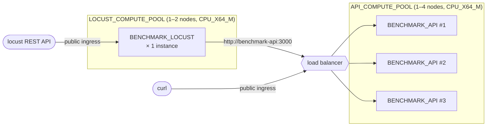

# Benchmark API + Locust on Snowpark Container Services

This folder contains everything needed to run the benchmark API server
**and** the [Locust](https://locust.io) load test entirely inside Snowflake, with public
ingress URLs you can hit from your laptop.

## Topology

Two services on two independent compute pools:



The API service runs **3 instances** (`API_MIN_INSTANCES` / `API_MAX_INSTANCES`)
spread across the API compute pool. Locust runs as a single instance. Instance
counts and pool sizes are configured in `config.env`.

## Directory layout

All paths below are relative to the repo root.

```
.cortex/skills/interactive-benchmark/benchmark/
├── .env                     # solution name + connection (from .env.template)
├── api/                     # FastAPI benchmark server source
├── locust/                  # Locust load generator source
├── test/                    # benchmark query .sql files
├── reports/                 # output reports (per run)
├── scripts/
│   ├── _lib.sh              # shared helpers (sources spcs/config.env)
│   ├── deploy.sh            # full SPCS deploy (prerequisites, build, push, create services)
│   ├── build-and-push.sh    # docker build + push both images
│   ├── status.sh            # service state + ingress URLs
│   ├── logs.sh              # tail container logs
│   ├── update.sh            # rebuild + ALTER SERVICE (preserves ingress URLs)
│   ├── resize-wh.sh         # resize interactive warehouse (size/MCW)
│   ├── list.sh              # list all SPCS resources
│   ├── teardown.sh          # drop services, compute pools, and image repo
│   └── update-progress.sh   # atomic progress.json updater
└── spcs/
    ├── config.env           # all knobs (connection, names, resources, locust params)
    ├── config.env.template  # template for config.env
    ├── api/                 # benchmark API image (Dockerfile, entrypoint, .dockerignore)
    ├── locust/              # locust image (Dockerfile, entrypoint, .dockerignore)
    └── specs/               # SPCS service YAML specs
```

All SQL is generated inline by the shell scripts from `spcs/config.env`; there
are no separate SQL files to keep in sync.

## Prerequisites

- Docker Desktop (or any local buildx-capable daemon).
- `snow` CLI configured with the connection listed in `spcs/config.env` (`PM` by default).
- The connection's role must be able to `CREATE COMPUTE POOL`, `CREATE IMAGE
  REPOSITORY`, and `CREATE SERVICE`. `ACCOUNTADMIN` works.
- The API's runtime role (`API_ROLE`) needs `USAGE` on the interactive
  warehouse and `SELECT` on the interactive schema.

## Deploying

```bash
.cortex/skills/interactive-benchmark/benchmark/scripts/deploy.sh
```

`deploy.sh` will:

1. Create `DB.SCHEMA`, **two independent compute pools** (one for the
   API, one for Locust), and the image repository (idempotent).
2. Build and push both images to the SPCS image repo.
3. `CREATE SERVICE` for:
   - `API_SERVICE` on `API_COMPUTE_POOL` — the benchmark API.
   - `LOCUST_SERVICE` on `LOCUST_COMPUTE_POOL` — the Locust load generator.
   Or `ALTER SERVICE` if they already exist.
4. Poll `SYSTEM$GET_SERVICE_STATUS` until both report `READY`.
5. Print the public ingress URLs.

## Naming convention

All object names are derived from `SOLUTION_NAME` (set in `benchmark/.env`).
With `SOLUTION_NAME=IW_TPCH`, the objects created are:

| Object | Name |
|--------|------|
| Database | `IW_TPCH_BENCH_DB` |
| Schema | `SPCS` |
| Image repository | `IW_TPCH_BENCH_IMAGES` |
| API compute pool | `IW_TPCH_BENCH_API_POOL` |
| Locust compute pool | `IW_TPCH_BENCH_LOCUST_POOL` |
| API service | `BENCHMARK_API` |
| Locust service | `BENCHMARK_LOCUST` |

Change `SOLUTION_NAME` in `benchmark/.env` to deploy multiple independent
instances in the same account.

## Iterating

Edit the app code (or `spcs/specs/*.yaml`) and run:

```bash
.cortex/skills/interactive-benchmark/benchmark/scripts/update.sh
```

`update.sh` rebuilds, pushes, and `ALTER SERVICE`s in place, so the public
ingress URLs stay the same.

## Auth model inside the container

Every SPCS container gets:

- `SNOWFLAKE_HOST`, `SNOWFLAKE_ACCOUNT` env vars.
- An OAuth token file at `/snowflake/session/token` scoped to the service's
  owner role.

`spcs/api/entrypoint.sh` writes a small `~/.snowflake/connections.toml`
pointing at that token file and sets `CONNECTION_NAME=spcs`. The unchanged
`api/server.py` picks it up via its normal `connections.toml` path.

## Running Locust via REST API

The Locust service exposes a public ingress URL. Control it via curl:

```bash
# Start a test
curl -s -X POST <LOCUST_URL>/swarm \
  -H 'Content-Type: application/x-www-form-urlencoded' \
  -d 'user_count=10&spawn_rate=5&host=http://benchmark-api:3000'

# Check stats
curl -s <LOCUST_URL>/stats/requests

# Stop the test
curl -s <LOCUST_URL>/stop
```

## Common operations

```bash
SCRIPTS=.cortex/skills/interactive-benchmark/benchmark/scripts

$SCRIPTS/deploy.sh              # full SPCS deploy (idempotent)
$SCRIPTS/list.sh                # list all SPCS resources in the schema
$SCRIPTS/status.sh              # show state + endpoints for both services
$SCRIPTS/status.sh --urls-only  # just the ingress URLs
$SCRIPTS/logs.sh api            # benchmark API logs
$SCRIPTS/logs.sh locust         # locust load-generator logs
$SCRIPTS/resize-wh.sh --size M  # resize the interactive warehouse
$SCRIPTS/teardown.sh            # drop services, compute pools, and image repo
```

## Granting another role access to the ingress URLs

By default only the service owner role can hit the public ingress URLs. To let
another role in:

```sql
USE ROLE ACCOUNTADMIN;
GRANT USAGE ON DATABASE <SOLUTION_NAME>_BENCH_DB TO ROLE <consumer_role>;
GRANT USAGE ON SCHEMA <SOLUTION_NAME>_BENCH_DB.SPCS TO ROLE <consumer_role>;
GRANT SERVICE ROLE <SOLUTION_NAME>_BENCH_DB.SPCS.BENCHMARK_API!ALL_ENDPOINTS_USAGE
  TO ROLE <consumer_role>;
GRANT SERVICE ROLE <SOLUTION_NAME>_BENCH_DB.SPCS.BENCHMARK_LOCUST!ALL_ENDPOINTS_USAGE
  TO ROLE <consumer_role>;
```

## Troubleshooting

- `snow spcs image-registry login` errors: re-run manually with
  `--connection $CONNECTION --role $ROLE`; tokens expire after ~1h.
- Service stuck in `PENDING`: `$SCRIPTS/logs.sh api` (or `locust`)
  — usually a missing grant on the runtime warehouse.
- Locust shows "0 requests" or logs `gaierror(-2, 'Name or service not known')`:
  the `LOCUST_HOST` DNS label is wrong. **SPCS converts underscores in the
  service name to hyphens in the DNS name** (e.g. `BENCHMARK_API` →
  `benchmark-api`). Both services must live in the same schema.
